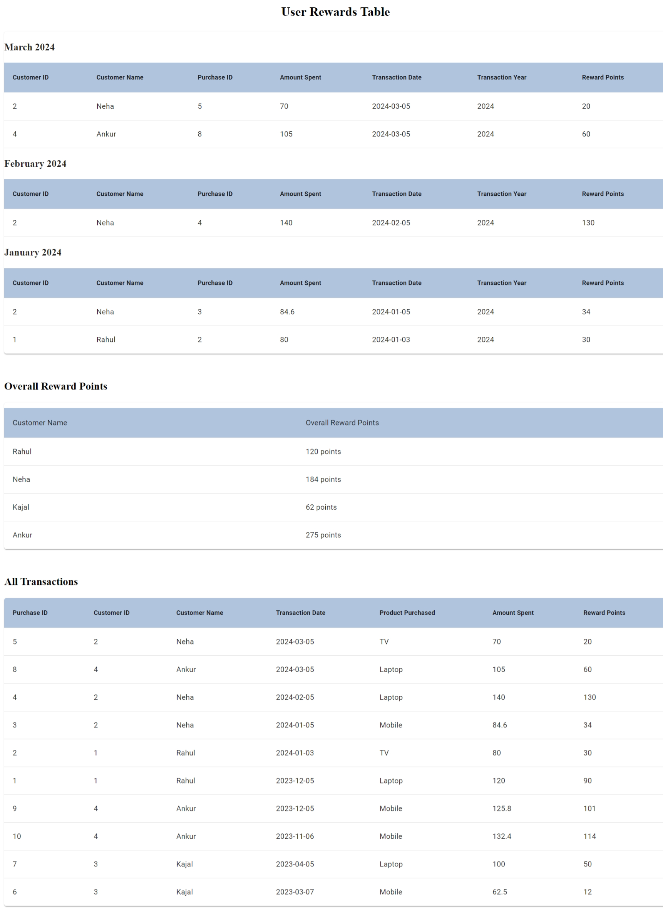

# Customer Rewards Program Calculator

A retailer offers a rewards program to its customers, awarding points based on each recorded purchase. 

## Project Description

A customer receives : 2 points for every dollar spent over $100 in each transaction, plus 1 point for every dollar spent between $50 and $100 in each transaction. 
(e.g. a $120 purchase = 2x$20 + 1x$50 = 90 points). 
  
Given a record of every transaction during a three month period, calculate the reward points earned for each customer per month and total. 

## Getting Started

### Prerequisites

- Node.js and npm installed

### Setup

1. **Clone the repository:**    
https://github.com/Aamnakakkar7/react-zjylwp

2. **Install dependencies:**
   npm install

3. **Start the React application:**
   npm start

4. **Test Case Run**
    npm run test

### Usage

The frontend application will be available at `http://localhost:3000`.

### Mock Data

The application uses mock from:
 `public/purchaseData.json`.

## Features

- Calculate Reward points earned for each customer per month and in total as per mock data
- Show data based on latest consecutive 3 month period of time
  - Transaction data can be with in the same year or spans different years

* Data is grouped based on years if it spans different years
* Multiple transactions within the month are sumed up together
* Rounded up rewards

* Loading screen and Error handling is implemented

## Screenshots

